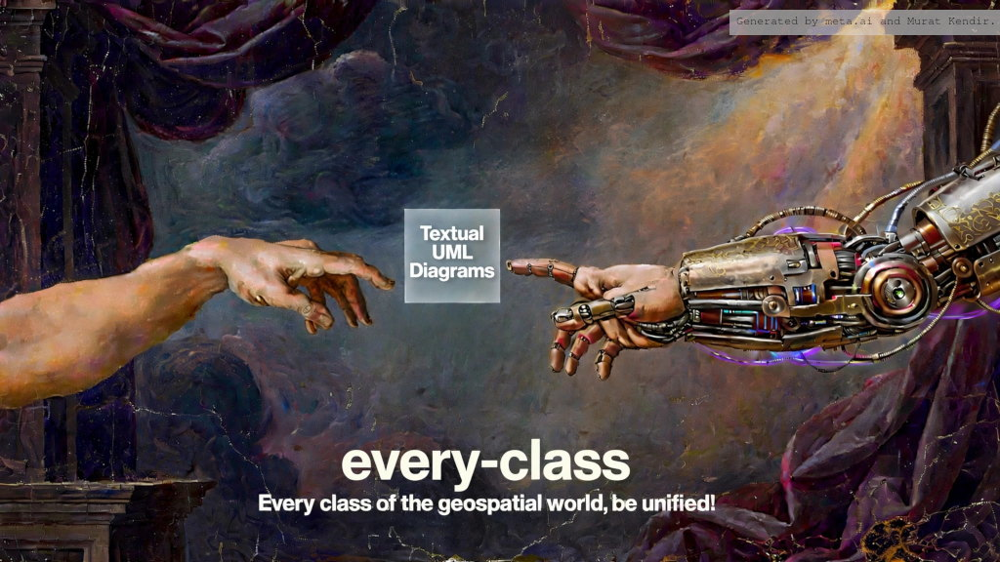

# every-class

This repository turns the XSD schemas of complex data models in the
geospatial domain into UML Class Diagrams, with one goal: human &
computer readability. The
same PlantUML source renders into clean diagrams that specialists can
read, navigate and print, while remaining structured plain text that
computer systems can parse, compare and process automatically.

UML class diagrams generated from XSD schemas with the
[`every_class.py`](https://github.com/muratkendir/every-class) pipeline.

## Data models

The generated PlantUML sources (`.puml`) and rendered diagrams live under
`output/<DataModel>/<Version>/UMLClassDiagram/`:

- **CityGML** — 2.0 (13 packages) and 3.0 (17 packages)
- **GML** — 3.1.1 (31 packages) and 3.2.1 (29 packages)
- **IndoorGML** — 1.1 (2 packages)
- **InfraGML** — 1.0 (15 packages, part0–part7)
- **XPlanung** — 6.1 (8 packages)

Each version folder contains one diagram per package plus a combined
`all_packages` diagram.

## Potential Areas of Use

- **Custom subsets of a data model** — copy an `all_packages.puml` file
  and simply delete the `!include` lines of the packages you don't
  need; the combined diagram shrinks to exactly your selection.
- **Cross-model, all-in-one diagrams** — a package in one data model
  often has implicit connections to another (e.g. CityGML 3.0
  `core:AbstractOccupiedSpace` builds on GML 3.2.1 solid geometry).
  Copy the relevant `.puml` files into one folder and combine them with
  `!include`: every class name is namespace-prefixed and quoted, so
  files merge without name clashes — in limitless combinations.
- **Dataset profiling with AI tools** — since the diagrams are plain
  text, you can hand a `.puml` file together with a sample dataset to
  an AI assistant and compare the two: which classes and attributes of
  the model actually occur in the data, in which combinations, and
  which parts of the model the dataset never touches — a quick way to
  understand the universe of an existing dataset.
